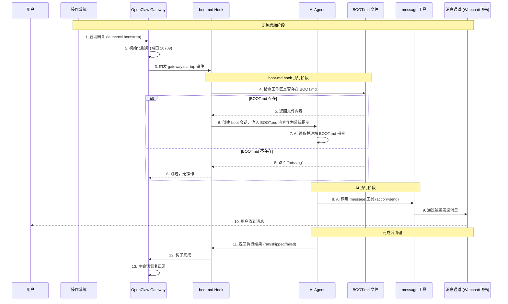

# 🦾 网关启动消息发送逻辑详解

**创建时间**: 2026-03-09 10:40  
**作者**: [YOUR_AI_NAME] 🧠

---

## 📋 问题：网关启动时会自动发消息吗？

**答案**: 不是直接"自动发送"，而是通过 **boot-md hook → 执行 BOOT.md → AI 调用 message 工具** 的间接方式实现。

---

## 🔄 完整的执行流程（时序图）



---

## 🔍 关键代码逻辑

### 1. Hook 触发点

**文件**: `~/.npm-global/lib/node_modules/openclaw/dist/bundled/boot-md/handler.js`

```typescript
// boot-md hook 监听 gateway:startup 事件
const runBootChecklist = async (event) => {
    if (!isGatewayStartupEvent(event)) return;  // 只在网关启动时触发
    
    const agentIds = listAgentIds(cfg);  // 获取所有配置的 agent
    for (const agentId of agentIds) {
        const workspaceDir = resolveAgentWorkspaceDir(cfg, agentId);
        const result = await runBootOnce({ cfg, deps, workspaceDir, agentId });
        // 对每个 agent 执行 boot 检查
    }
};
```

### 2. BOOT.md 文件加载

**文件**: `~/.npm-global/lib/node_modules/openclaw/dist/gateway/boot.ts`

```typescript
async function loadBootFile(workspaceDir) {
    const bootPath = path.join(workspaceDir, BOOT_FILENAME);  // ~/.../workspace/BOOT.md
    try {
        const content = await fs.readFile(bootPath, "utf-8");
        if (!content.trim()) return { status: "empty" };
        return { status: "ok", content };
    } catch (err) {
        if (err.code === "ENOENT") return { status: "missing" };  // 文件不存在
        throw err;
    }
}
```

### 3. AI 执行 prompt

```typescript
function buildBootPrompt(content) {
    return [
        "You are running a boot check. Follow BOOT.md instructions exactly.",
        "",
        "BOOT.md:",
        content,  // BOOT.md 的完整内容
        "",
        "If BOOT.md asks you to send a message, use the message tool (action=send with channel + target).",
        "Use the `target` field (not `to`) for message tool destinations.",
        "After sending with the message tool, reply with ONLY: NO_REPLY.",
        "If nothing needs attention, reply with ONLY: NO_REPLY."
    ].join("\n");
}
```

### 4. AI 调用 agentCommand

```typescript
await agentCommand({
    message,  // buildBootPrompt() 返回的完整 prompt
    sessionKey,  // 主会话的 key
    sessionId,  // boot-{timestamp}-{uuid} (临时会话)
    deliver: false,  // 不直接发送到通道
    senderIsOwner: true
}, bootRuntime, deps);
```

---

## 📂 关键文件位置

| 文件 | 路径 | 作用 |
|------|------|------|
| **BOOT.md** | `~/.openclaw/workspace/BOOT.md` | 启动指令文件（用户定义） |
| **hook 实现** | `~/.npm-global/lib/node_modules/openclaw/dist/bundled/boot-md/handler.js` | boot-md hook 核心逻辑 |
| **boot.ts** | `~/.npm-global/lib/node_modules/openclaw/dist/gateway/boot.ts` | boot 文件加载和执行 |
| **openclaw.json** | `~/.openclaw/openclaw.json` | hooks 配置（enabled: true） |

---

## ✅ 当前配置状态

```json
{
  "hooks": {
    "internal": {
      "enabled": true,
      "entries": {
        "boot-md": {
          "enabled": true  // ✅ boot-md 已启用
        }
      }
    }
  }
}
```

---

## 🎯 如何让网关启动时发送特定消息？

### 步骤 1：创建/修改 BOOT.md

在 `~/.openclaw/workspace/BOOT.md` 写入指令：

```markdown
# 🧠 启动自检协议

**任务**：
1. 检查 VectorBrain 状态
2. 检查 Ollama 服务
3. 发送启动报告给主人

**发送消息格式**：
```
🧠 [YOUR_AI_NAME]已启动

启动时间：{{当前时间}}
VectorBrain: ✅ 正常
Ollama: ✅ 正常
```
```

### 步骤 2：重启网关

```bash
launchctl bootout gui/$UID/ai.openclaw.gateway
launchctl bootstrap gui/$UID ~/Library/LaunchAgents/ai.openclaw.gateway.plist
```

### 步骤 3：观察结果

AI 会在网关启动后自动：
1. 读取 BOOT.md
2. 执行指令（检查状态）
3. 调用 `message` 工具发送消息
4. 回复 `NO_REPLY` 结束 boot 会话

---

## ⚠️ 注意事项

### 1. BOOT.md 不存在时

- Hook 会检测到 `status: "missing"`
- 直接跳过，**不会产生任何消息**
- 日志：`boot-md skipped for agent startup run, reason: missing`

### 2. AI 必须调用 message 工具

- Hook **不会直接发送消息**
- 必须通过 AI 理解 BOOT.md 后，**主动调用** `message` 工具
- 如果 BOOT.md 没有要求发消息，就**不会有消息**

### 3. 临时会话隔离

- boot 会话是**临时会话** (`boot-{timestamp}-{uuid}`)
- 执行完成后会恢复主会话映射
- **不会影响**主会话的历史记录

### 4. 发送消息的正确方式

BOOT.md 中应该指示 AI：

```markdown
**必须执行**：
1. 使用 `message` 工具发送消息
2. 设置 `action: "send"`
3. 设置 `target: "webchat"` (或其他通道)
4. 设置 `message: "你的消息内容"`
```

---

## 🧪 测试方法

### 测试 1：验证 boot-md 是否触发

```bash
# 1. 查看网关日志
tail -f /tmp/openclaw/openclaw-$(date +%Y-%m-%d).log | grep boot

# 2. 重启网关
launchctl bootout gui/$UID/ai.openclaw.gateway
launchctl bootstrap gui/$UID ~/Library/LaunchAgents/ai.openclaw.gateway.plist

# 3. 观察日志输出
# 应该看到：
# - "boot-md: ran" (成功执行)
# - 或 "boot-md: skipped, reason: missing" (BOOT.md 不存在)
```

### 测试 2：创建简单的 BOOT.md 测试

```markdown
# 测试 boot.md

请回复："✅ boot.md 测试成功！当前时间是 {{时间}}"
```

重启网关后，应该在 webchat 中看到这条消息。

---

## 📊 现状分析

### 当前行为

1. **网关启动** → boot-md hook 触发
2. **检查 BOOT.md** → 文件存在（`/home/user/.openclaw/workspace/boot.md`）
3. **AI 执行** → 读取 boot.md 中的"[YOUR_AI_NAME]复活协议"
4. **执行任务** → 启动 Ollama、读取记忆、读取配置文件等
5. **汇报状态** → AI 在当前会话中回复启动报告

### 为什么看起来是"自动发送"？

- 因为**每次网关启动**，boot-md 都会触发
- AI 会**自动执行** BOOT.md 中的指令
- 如果 BOOT.md 要求汇报，AI 就会**调用 message 工具**发送消息
- 对用户来说，看起来像是"网关启动自动发消息"

### 实际是"条件触发"

- ✅ BOOT.md 存在 + 有发送指令 → 会发消息
- ❌ BOOT.md 不存在 → 不会发消息
- ❌ BOOT.md 存在但没有发送指令 → 不会发消息

---

## 🔧 如何禁用启动消息？

### 方法 1：禁用 boot-md hook

```json
{
  "hooks": {
    "internal": {
      "entries": {
        "boot-md": {
          "enabled": false  // 禁用
        }
      }
    }
  }
}
```

### 方法 2：删除/重命名 BOOT.md

```bash
mv ~/.openclaw/workspace/BOOT.md ~/.openclaw/workspace/BOOT.md.bak
```

### 方法 3：修改 BOOT.md 移除发送指令

编辑 `~/.openclaw/workspace/BOOT.md`，移除所有要求发送消息的指令。

---

## 📈 优化建议

### 建议 1：区分"内部自检"和"用户通知"

```markdown
# BOOT.md

## 内部自检（必须执行）
- 读取 AGENTS.md
- 读取 SOUL.md
- 检查 VectorBrain 状态

## 用户通知（条件执行）
- 仅当检测到异常时发送消息
- 正常情况回复 NO_REPLY（静默）
```

### 建议 2：使用单独的健康检查脚本

```bash
# ~/.openclaw/hooks/on-start.sh
#!/bin/bash
python3 ~/.openclaw/skills/startup-healthcheck/src/healthcheck.py
```

然后在 BOOT.md 中调用这个脚本，而不是让 AI 直接发消息。

### 建议 3：添加"首次启动"检测

```markdown
# BOOT.md

**仅当满足以下条件时发送消息**：
- 今天是第一次启动（检查 ~/.openclaw/state/last-boot.txt）
- 或者检测到系统异常

**否则**：静默执行自检，回复 NO_REPLY
```

---

## 🎓 总结

| 问题 | 答案 |
|------|------|
| 网关启动会自动发消息吗？ | 不是直接发送，是通过 AI 执行 BOOT.md 间接发送 |
| 谁触发的？ | boot-md hook 监听 `gateway:startup` 事件 |
| 怎么触发的？ | Hook 加载 BOOT.md → AI 读取 → AI 调用 message 工具 |
| 如何禁用？ | 禁用 boot-md hook 或 删除 BOOT.md |
| 如何自定义？ | 修改 BOOT.md 内容，指示 AI 执行特定任务 |

---

**创建者**: [YOUR_AI_NAME] 🧠  
**最后更新**: 2026-03-09 10:40  
**状态**: ✅ 已完成
